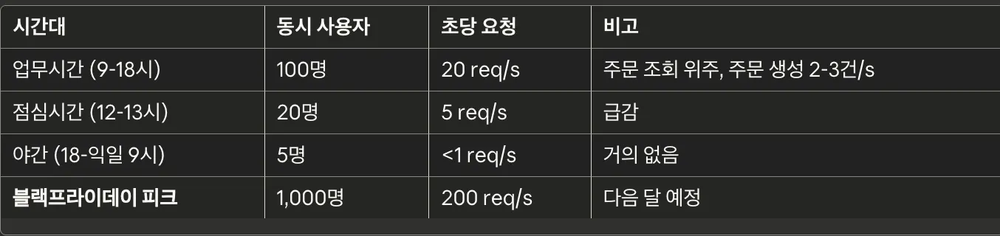

# ARCHITECTURE_DESIGN.md
## **Step 1: 운영팀장 요구사항 분석 - "자동 복구"**

| 장애 종류 | 발생 원인 | 자동 복구 가능 여부 | 복구 방법 | 예상 복구 시간 | 활용할 AWS 기능 | 비고 |
| --- | --- | --- | --- | --- | --- | --- |
| App 크래시 | OutOfMemoryError | ✅ 가능 | Task 자동 재시작 | 30초 | ECS Health Check |  |
| App 응답 없음 | 데드락, Thread Pool 고갈 | ✅ 가능 | Task 자동 재시작 | 30초 | ECS Health Check |  |
| **인스턴스/호스트 레벨 장애** | 하드웨어 고장  | ✅ 가능 | 인스턴스 교체 | 60초
(애플리케이션 재시작 시간만큼 소요) | ECS Health Check + Auto Scaling  |  |
| **AZ(가용영역) 
레벨 장애** | 화재 및 정전 | ✅ 가능 | Multi-AZ 통한 복구 | 1초 | Multi-AZ |  |
| RDS Primary
장애 (RDS Faliover) | DB 서버 크래시 | ✅ 가능 | RDS Multi-AZ | 30초 | Multi-AZ |  |
| RDS Disk Full | 스토리지 부족 | ☑️ 부분 가능 | auto disk scaling  | 1초 | RDS enable storage autoscaling | 최대 용량(Max Storage) 이전에 모니터링 추적 |
| 코드 레벨 문제(무한루프 등) | 코드 레벨 버그 | ❌ 불가능 | 수동 버그 수정 | 수분~수십시간 | ECS Health Check  | ECS Health Check 등을 통해 지속적으로 발생하는 장애 감지 후 수동으로 복구 필요 |

**비기술자에게 설명하기**

1. **애플리케이션 문제가 발생했을 때 (버그, 무한 루프, 응답 없음 등)**
    - 시스템은 **정기적으로 서비스가 정상 응답하는지 스스로 점검**합니다.
    - 일정 시간 동안 응답이 없으면 “문제가 생겼다”고 판단합니다.
    - 그 즉시 **문제가 있는 서버를 중단하고**, **새로운 서버를 자동으로 띄웁니다**.
    - 새 서버가 정상 작동한다고 확인되면
        
        **바로 트래픽(유저 요청)을 새 서버로 전환**합니다.
        
    
    **사람 개입 없이 1~2분 내 자동 복구**
    
2. **데이터베이스(DB) Primary 서버에 장애가 발생했을 때**
    - DB는 원래 두 대가 페어로 운영됩니다.
        
        (하나는 실제 업무 처리, 하나는 대기 상태)
        
    - 주(DB)가 장애가 나면, **대기 중이던 DB가 즉시 주 DB 역할을 이어받습니다**.
    - 그 후, **시스템이 자동으로 연결 정보를 업데이트**하여 모든 요청이 새 주 DB로 가도록 변경됩니다.
    
    **⇒ 몇 초 안에 자동 전환, 서비스 영향 최소**
    
3. **호스트 장애 (서버 머신 자체 고장)**
    - 어떤 서버 머신 전체가 고장 나면,
        
        그 안에서 돌아가던 서비스들이 모두 영향을 받습니다.
        
    - 시스템은 이를 인식하고,
        
        **그 서버에서 돌던 서비스들을 자동으로 다른 서버에서 다시 시작**합니다.
        
    
    **⇒ 몇 분 내 자동 복구, 서비스 지속 가능**
    
4. **AZ(가용 영역) 장애 (특정 건물/센터 전체 이슈)**
    - AWS는 같은 지역이라도 여러 건물에 나눠져 운영됩니다(AZ).
    - 특정 건물 전체가 문제가 생기면
        
        시스템이 “이 건물은 사용 불가”라고 판단합니다.
        
    - 그러면 **다른 건물(AZ)에 있는 서버로 자동으로 서비스가 이동**합니다.
    
    **⇒ 서비스 중단을 최소화한 자동 재배치**
    
5. **DB 디스크가 꽉 찼을 때(RDS Disk Full)**
    - AWS는 **디스크 사용량을 계속 감시**하고 있습니다.
    - 용량이 부족하면 자동으로 디스크 크기를 늘리려고 시도합니다.
    - 대부분의 경우 이 작업으로 자동 복구됩니다.
    - 만약 최대 용량까지 차서 자동 확장이 불가능한 상황이면,
        
        그때는 **운영팀이 직접 개입해서 정리·확장 작업을 해야 합니다.**
        
    
    **⇒ 거의 자동 복구되지만, 예외 상황은 수동 조치 필요**
    
6. **코드 레벨 문제(무한 루프, CPU 폭주 등)**
    - 시스템은 CPU 사용률, 응답 속도 등을 계속 모니터링합니다.
    - 일정 시간 이상 비정상적인 상태가 이어지면
        
        “프로그램이 정상 작동하지 않는다”고 판단합니다.
        
    - 그러면 **문제가 있는 서버만 자동으로 교체**합니다.
    
    **⇒ 문제 서버만 자동 교체하여 서비스 지속**

## **Step 2: 비즈니스팀장 요구사항 분석 - "Auto Scaling" (전략 수립)**

| 단계 | 시기 | 목표 | 구현 내용 | 위험 관리 |
| --- | --- | --- | --- | --- |
| 1단계 | 지금(런칭) | 안정적 서비스 시작 | 고정 Task 개수(각 서비스당 2개), 수동 조정 | CloudWatch 모니터링 & 알림 |
| 2단계 | 2주 후 | Auto Scaling 적용 | 큐 기반 auto scaling 설정
(Task 범위는 DB 병목, SLA 예산 고려) | CloudWatch 모니터링 & 알림 및 
부하 테스트 검증 |
| 예상가능한 트래픽 급증(블랙 프라이데이) | 이벤트 기간 | Scheduled Scaling 적용 | Scheduled Scaling 
(SLA & 예산 고려) | auto Scaling (큐 기반) 함께 적용 |

<aside>

    📌비즈니스팀장 설득 논리

    가장 중요한 **런칭 초기 단계**에는 서비스 안정성을 최우선으로 확보하기 위해, 예상 트래픽을 여유 있게 감당할 수 있는 수준으로 Task 개수를 미리 프로비저닝해 두겠습니다.

    만약 예상을 뛰어넘는 트래픽 급증이 발생할 경우에는, 실시간 모니터링 알림을 통해 즉각적으로 상황을 인지하고 **수동으로 스케일 아웃**하여 유연하게 대처할 계획입니다.

    서비스 안정화 이후에는 축적된 트래픽 패턴 데이터를 분석하여 오토 스케일링(Auto Scaling)을 도입하겠습니다. 이때는 비용 효율성과 고가용성, 그리고 병목 리소스를 종합적으로 고려해 최적의 Min/Max 임계치를 설정할 것입니다.

    아울러 블랙 프라이데이와 같이 트래픽 폭주가 예견되는 특수 시즌에는, 학습된 데이터를 기반으로 사전에 리소스를 증설하는 **스케줄링(Scheduled) 방식**을 적용해 서비스 장애를 원천 차단하겠습니다
</aside>

## Step 3: 보안팀장 요구사항 분석 - "DB 격리"

### 전체 AWS 아키텍처

### Security Group 관계

## Step 4: 재무팀장 요구사항 분석 - "예산 월 15만원"

### 예상 요금 계산

### 최종 제안

제안: 월 20만원 예산에 맞춰 다음 구성을 구현합니다.
(비용 절감을 최우선으로 하되, 서비스 안정성에 필요한 최소 요소는 유지합니다.)

1. Single-AZ RDS
    Multi-AZ 대비 약 50~60% 비용 절감
    자동 백업 + 스냅샷 유지 (7~35일)
    장애 시 복구 시간 5~10분 수준이나, 현재 트래픽 규모에서는 감내 가능
    비용 대비 효과가 가장 큰 구조

2. ECS Task 최소 구성 (2개 운영)
    Auto Scaling 적용
    트래픽 증가 시 자동 수평 확장 가능
    불필요한 고가용성 비용 제거
    현재 사용자 규모·QPS 기준 충분한 처리량 확보 가능

3. NAT Gateway 유지
    NAT Instance 전환 대신 NAT Gateway 그대로 유지
    관리형 NAT으로 안정성·보안성·운영 편의성 확보

4. CloudWatch Logs 보관 기간 7일로 축소
    장애 분석에 필요한 최소 보관 기간
    로그 스토리지 비용 약 70% 절감

5. Amazon ElastiCache (단일 노드, Redis)
    Session 관리·Ranking·Token 저장 등에서 필수 역할
    Multi-AZ 구성 제거 → Single-AZ 단일 노드 구성
    → 비용 60% 절감
    장애 시 재생성 1~2분 소요되나, 데이터 휘발성 특성 상 서비스 영향 제한적

6. Application Load Balancer (ALB)
    ALB는 서비스 진입점이므로 필수 유지
    Target Group을 통해 ECS Task 자동 헬스체크
    비용이 낮은 편(월 2만원 수준)

7. Bastion Host (t3.nano + 스토리지 최소화)
    RDS가 Private Subnet에 있으므로 관리·운영 목적의 최소 구성 필요
    t3.nano 기준 월 3~4천원 내외
    SSH Key + IP 제한으로 보안은 유지하되 비용 최소화

이 구성은 월 약 18~21만원 수준으로 유지되며,
재무팀 목표인 **“월 15만원 내외 예산”**을 초과합니다. 
AWS의 구조적 최소 비용(필수 3요소: NAT Gateway, ALB, RDS)만으로 이미 약 16~18만원이 산출되므로 기술적으로 15만원 이하 구성은 현실적으로 불가능합니다.
다만 월 20만원 구성으로 비용을 최소화하면서도 서비스 안정성과 보안을 유지할 수 있으므로 해당안을 제안드립니다.

## Step 5: CTO 요구사항 분석 - "SLA 준수"

작성하지 못했습니다.