# DEPLOYMENT_REPORT.md

## 네트워크 구성 확인

### VPC Resource Map
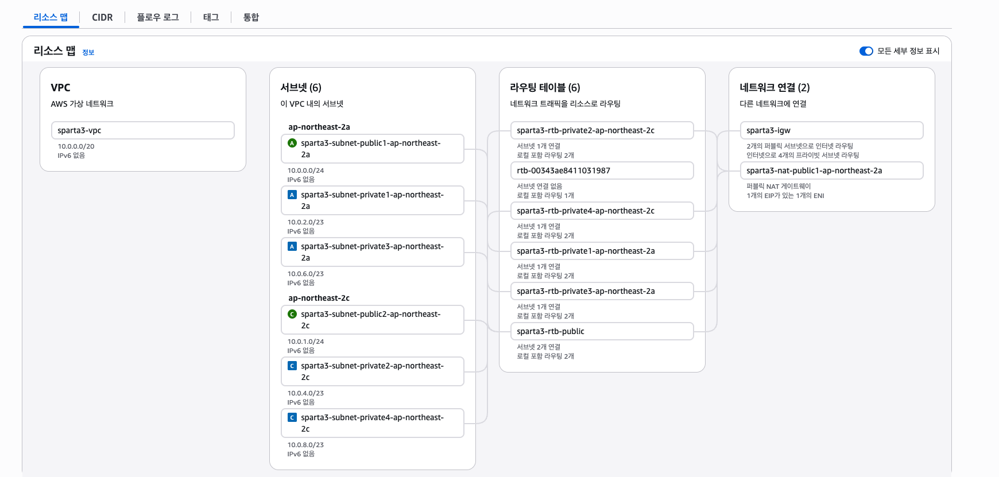

### Security Groups 설정
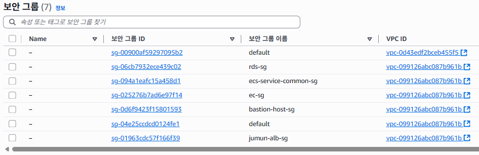

### NAT Gateway Status "Available"
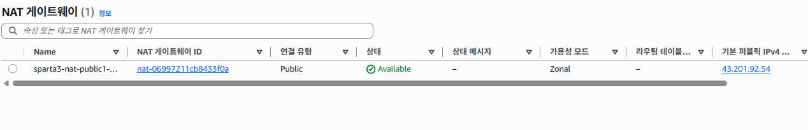

## 데이터베이스 구성 확인

### RDS 인스턴스 상세
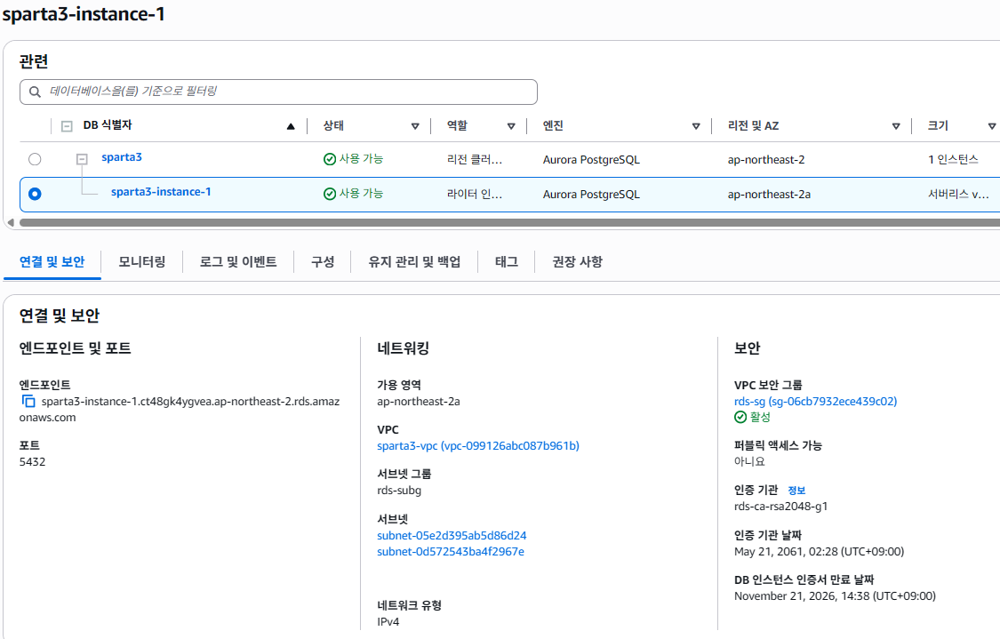

### Bastion에서 MySQL 접속 성공
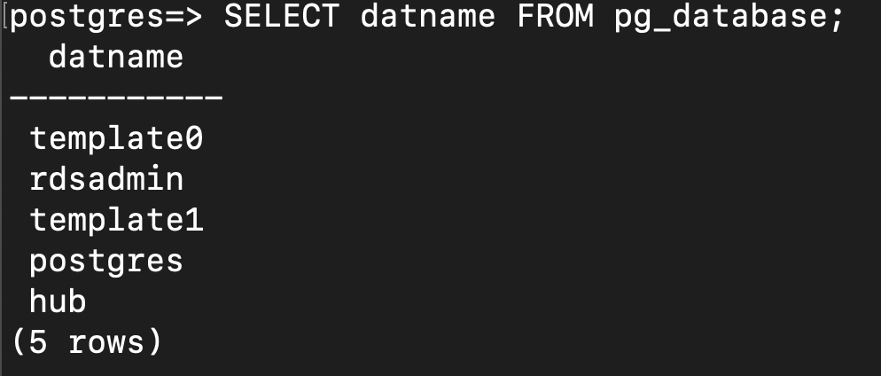

## 컨테이너 배포 확인
### ECR 이미지 목록
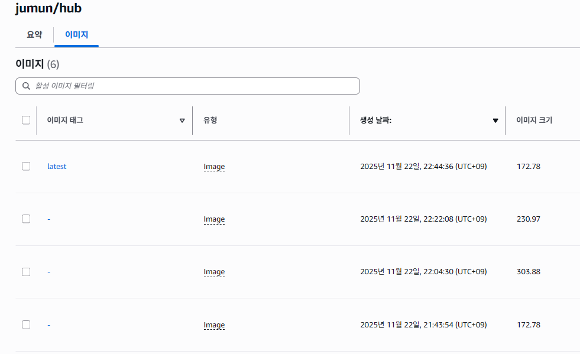

### ECS Services 목록
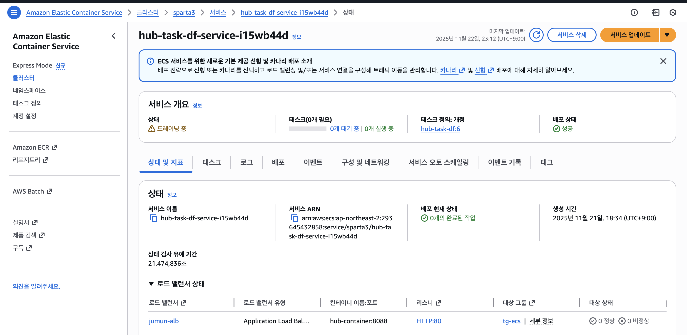

### CloudWatch Logs
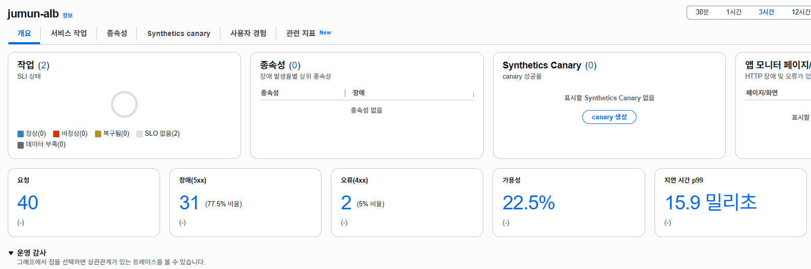

## 동작 검증
### API 호출 결과 (주문 생성 성공)
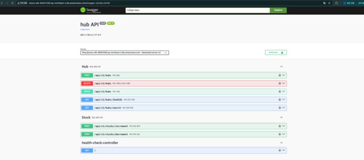
### 이벤트 전파 확인
못했습니다 ㅠ
### MySQL 데이터 확인
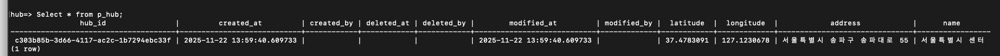
### 전체 아키텍처 체크리스트 완성본
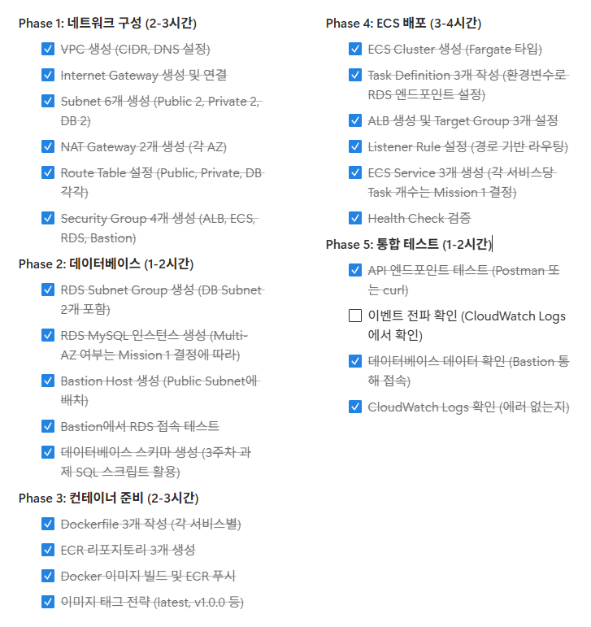